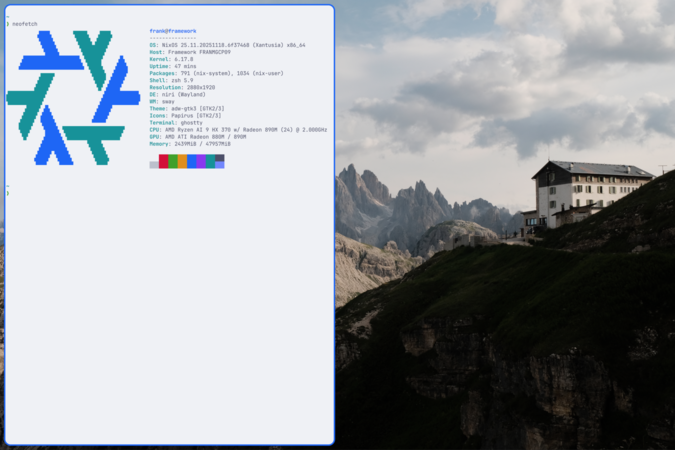
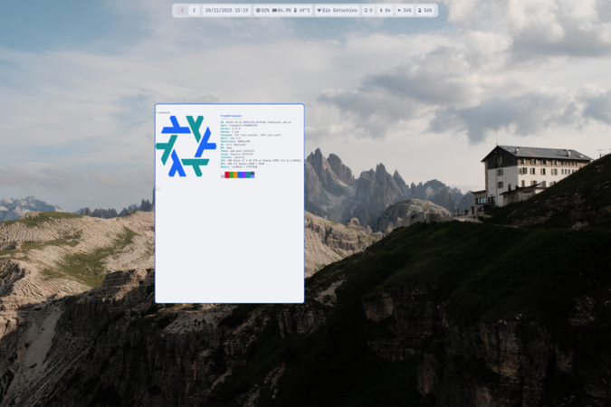
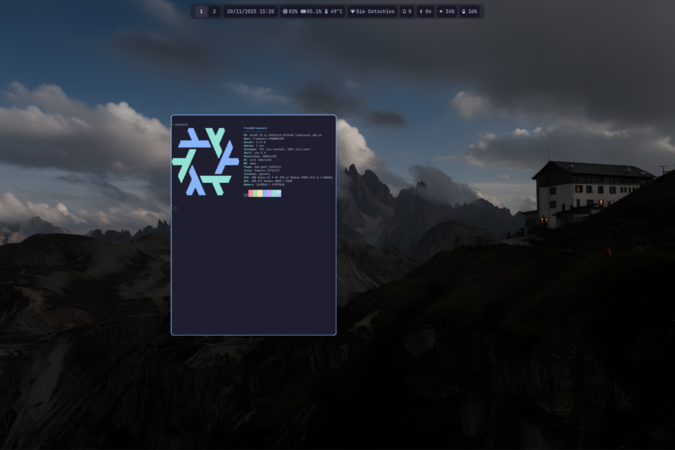

# NixOS Configuration

Personal NixOS configuration for a Framework 13 laptop with the Niri window manager.

## Screenshots

### Light Mode

<table>
  <tr>
    <td align="center">
      <a href="./screenshots/desktop_light.png">
        
      </a>
      <br/>
      Desktop
    </td>
    <td align="center">
      <a href="./screenshots/overview_light.png">
        
      </a>
      <br/>
      Overview
    </td>
  </tr>
</table>

### Dark Mode

<table>
  <tr>
    <td align="center">
      <a href="./screenshots/desktop_dark.png">
        
      </a>
      <br/>
      Desktop
    </td>
    <td align="center">
      <a href="./screenshots/overview_dark.png">
        
      </a>
      <br/>
      Overview
    </td>
  </tr>
</table>

## Quick Start

The repository uses **devenv** with **direnv** for automatic environment activation. The development environment provides git hooks, Claude Code integration, and custom rebuild commands.

```bash
# First time setup (install devenv and approve direnv)
sudo nixos-rebuild switch --flake ~/nixos-config#framework
cd ~/nixos-config
direnv allow

# Daily usage - environment activates automatically
cd ~/nixos-config

# Rebuild system configuration
rebuild switch    # Apply changes immediately
rebuild           # Prepare for next boot (default)

# Update all flake inputs
nix flake update

# Format Nix files (happens automatically on commit)
nixfmt **/*.nix
```

> **Note:** This configuration uses [nh](https://github.com/nix-community/nh) (Nix Helper) instead of `nixos-rebuild` for better progress output, faster builds, and visual diffs of package changes. The `rebuild` script is available when the devenv environment is active. See [Development Environment](./docs/development-environment.md) for details.

## Desktop Environment

This configuration uses a minimal, keyboard-driven Wayland desktop:

### Niri (Window Manager)

[Niri](https://github.com/YaLTeR/niri) is a scrollable-tiling Wayland compositor. Windows are arranged in columns that scroll horizontally, similar to PaperWM. This configuration uses `niri-unstable` from the [niri-flake](https://github.com/sodiboo/niri-flake) for the latest features, with the niri binary cache configured for faster builds.

Key features in this setup:
- Workspaces numbered 1-9, accessible via `Mod+1` through `Mod+9`
- Transparent workspace backgrounds (wallpaper shows through)
- 12px gaps between windows
- Rounded corners (12px radius)
- Variable refresh rate on external monitors
- Overview mode (`Mod+O`) shows all windows

### Vicinae (Application Launcher)

[Vicinae](https://github.com/coco/vicinae) is the application launcher. Press `Mod+Space` to open it and start typing to search for applications.

### Ironbar (Status Bar)

[Ironbar](https://github.com/JakeStanger/ironbar) displays system information at the top of the screen:

- **Workspaces** - Click to switch workspaces
- **Clock** - Current time
- **System stats** - CPU %, Memory %, Temperature
- **WiFi status** - Connection indicator
- **Notifications** - Unread count with popup history
- **Bluetooth** - Connection status
- **Volume** - Current level (click to adjust)
- **Storage** - Mounted removable devices (USB/SD cards)
- **Battery** - Percentage, charging state, and power profile switching

## Keyboard Shortcuts

### Essential

| Shortcut | Action |
|----------|--------|
| `Mod+Space` | Open application launcher (Vicinae) |
| `Mod+G` | Open terminal (Ghostty) |
| `Mod+Q` | Close focused window |
| `Mod+O` | Toggle overview mode |
| `Mod+Shift+E` | Exit Niri |
| `Mod+Shift+S` | Suspend system |
| `Mod+Shift+Slash` | Show hotkey overlay |
| `Mod+A` | Open audio control (pavucontrol) |

### Window Navigation

| Shortcut | Action |
|----------|--------|
| `Mod+H/J/K/L` or `Mod+Arrows` | Focus column/window in direction |
| `Mod+Ctrl+H/J/K/L` | Move window in direction |
| `Mod+Home/End` | Focus first/last column |

### Window Layout

| Shortcut | Action |
|----------|--------|
| `Mod+F` | Maximize column |
| `Mod+Shift+F` | Toggle fullscreen |
| `Mod+V` | Toggle floating mode |
| `Mod+W` | Toggle tabbed column display |
| `Mod+C` | Center column |
| `Mod+R` | Switch preset column widths (75%/50%/25%) |
| `Mod+Shift+R` | Switch preset window heights |
| `Mod+Minus/Equal` | Decrease/increase column width |
| `Mod+Shift+Minus/Equal` | Decrease/increase window height |

### Workspaces

| Shortcut | Action |
|----------|--------|
| `Mod+1-9` | Switch to workspace 1-9 |
| `Mod+Ctrl+1-9` | Move window to workspace 1-9 |
| `Mod+Tab` | Previous workspace |
| `Mod+U/I` or `Mod+PageUp/Down` | Previous/next workspace |

### Multi-Monitor

| Shortcut | Action |
|----------|--------|
| `Mod+Shift+H/L` or `Mod+Shift+Left/Right` | Focus monitor |
| `Mod+Shift+Ctrl+H/L` | Move window to monitor |
| `Mod+Shift+D` | Toggle internal display on/off |
| `Mod+Shift+P` | Power off all monitors |

### Media & Hardware

| Shortcut | Action |
|----------|--------|
| `XF86AudioRaiseVolume/LowerVolume` | Adjust volume (with OSD) |
| `XF86AudioMute` | Toggle mute (with OSD) |
| `XF86MonBrightnessUp/Down` | Adjust brightness (with OSD) |
| `XF86AudioPlay/Prev/Next` | Media controls |
| `Mod+Ctrl+P` | Toggle CPU governor (schedutil/powersave) |

Volume and brightness keys show an on-screen display (OSD) overlay via SwayOSD.

### Screenshots

| Shortcut | Action |
|----------|--------|
| `Print` | Screenshot area to clipboard |
| `Ctrl+Print` | Screenshot screen to clipboard |
| `Shift+Print` | Screenshot window to clipboard |

## Network Management

WiFi and Bluetooth connections are managed via terminal commands:

### WiFi (NetworkManager)

```bash
# List available networks
nmcli device wifi list

# Connect to a network
nmcli device wifi connect "SSID" password "password"

# Show saved connections
nmcli connection show

# Connect to a saved network
nmcli connection up "connection-name"

# Disconnect
nmcli device disconnect wlan0
```

### Bluetooth (bluetoothctl)

```bash
# Open bluetooth control
bluetoothctl

# Inside bluetoothctl:
power on           # Enable bluetooth
scan on            # Start scanning
devices            # List discovered devices
pair XX:XX:XX:XX   # Pair with device
connect XX:XX:XX:XX # Connect to device
disconnect         # Disconnect current device
```

## Installed Software

### System Packages

Core utilities installed at the system level in `modules/system/packages.nix`:

- **Shell:** zsh
- **Editor:** vim
- **Version Control:** git
- **Networking:** wget, networkmanager
- **Security:** tpm2-tss, sbctl (secure boot)

### User Applications

Installed via home-manager in `home-manager/packages.nix`:

#### Productivity
- **anytype** - Note-taking and knowledge management
- **ticktick** - Task management
- **signal-desktop** - Encrypted messaging
- **zapzap** - WhatsApp client
- **slack** - Team communication
- **discord** - Voice and text chat
- **spotify** - Music streaming

#### Web Browsers
- **zen-browser** - Privacy-focused Firefox fork
- **chromium** - For compatibility testing

#### Development
- **zed-editor** - Modern code editor
- **helix** - Modal terminal editor
- **jetbrains.idea-community-bin** - Android development
- **gh** - GitHub CLI
- **nil**, **nixd** - Nix language servers

#### AI Tools
- **opencode** - AI coding agent with MCP server support (Context7, Anytype)
- **claude-code** - Anthropic's AI coding assistant
- **gemini-cli** - Google's Gemini AI

#### Terminal & CLI
- **ghostty** - GPU-accelerated terminal
- **bat** - Syntax-highlighted cat
- **eza** - Modern ls replacement
- **fd** - Fast find alternative
- **fzf** - Fuzzy finder
- **htop** - Process viewer
- **tree** - Directory tree viewer
- **yazi** - Terminal file manager
- **superfile** - Terminal file manager with preview
- **lf** - Terminal file manager
- **navi** - Interactive cheatsheet
- **neofetch** - System info display
- **starship** - Cross-shell prompt
- **powertop** - Monitor system power usage

#### File Management
- **nautilus** - GNOME file manager
- **sushi** - Quick file previewer

#### Media
- **playerctl** - Media player control
- **pavucontrol** - PulseAudio volume control
- **upscayl** - AI image upscaler
- **imagemagick** - Image manipulation

#### Desktop Environment
- **niri** - Scrollable-tiling Wayland compositor
- **ironbar** - Customizable status bar
- **vicinae** - Application launcher
- **dunst** - Notification daemon
- **swayosd** - On-screen display for volume/brightness
- **swaylock** - Screen locker
- **awww** - Wallpaper daemon with fade transitions
- **brightnessctl** - Brightness control

#### Theming
- **papirus-icon-theme** - Icon theme
- **stylix** - Automatic application theming

#### Security
- **1password** - Password manager (GUI and CLI)
- **gnome-keyring** - Secure credential storage

### Android Development

Optional Android development environment (`home-manager/android.nix`):
- Android Studio Canary
- Android SDK (build-tools, platform-tools, emulator)
- Platform SDK for Android 34

## Configuration Structure

### Overview

```
nixos-config/
├── flake.nix              # Entry point - defines inputs and outputs
├── hosts/                 # Machine-specific configurations
│   └── framework/         # Framework laptop config
├── modules/               # System-level NixOS modules
│   ├── desktop/           # Display manager, compositor
│   ├── hardware/          # Hardware-specific configs
│   ├── services/          # System services
│   ├── system/            # Core system settings
│   └── theming/           # System-wide theming
├── home-manager/          # User-level configurations
│   ├── frank.nix          # Main user config
│   ├── packages.nix       # User packages
│   ├── niri/              # Window manager config
│   ├── ironbar/           # Status bar config
│   └── ...                # Application configs
├── overlays/              # Package modifications
└── docs/                  # Detailed documentation
```

### System vs Home-Manager

This configuration separates concerns between system-level and user-level settings:

**System Level** (`modules/`):
- Boot configuration and kernel parameters
- Hardware drivers and firmware
- System services (greetd, darkman, pipewire, bluetooth)
- Network management
- Power management (TLP)
- Security (PAM, polkit, TPM)
- System users and groups

**Home-Manager Level** (`home-manager/`):
- User applications and packages
- Shell configuration (zsh, starship)
- Application settings (git, ssh, editors)
- Window manager keybindings and rules
- Desktop environment (ironbar, vicinae, dunst)
- User services (swayidle, battery notifications)
- Theming specializations (dark/light modes)

## Features

### Theming

- **Stylix** automatically themes all applications
- **Catppuccin** color scheme (Mocha dark, Latte light)
- **Darkman** switches themes based on time of day
- Light/dark mode without rebuild using specializations
- Fonts: JetBrainsMono Nerd Font, Noto Sans/Serif

### Wallpaper Management

- **awww** (animated wayland wallpaper daemon) runs continuously from Niri startup
- Wallpapers change automatically with light/dark mode transitions
- Smooth fade transitions (1 second) between wallpapers
- Wallpaper placed on backdrop layer (visible in overview mode)
- Light mode: `mountain.jpg`, Dark mode: `mountain_dark.jpg`

**How it works:**
1. `awww-daemon` starts with Niri and stays running
2. Darkman detects time-based mode (light/dark) based on sunrise/sunset
3. When mode changes, darkman sends `awww img` command with new wallpaper
4. awww fades smoothly to the new wallpaper without daemon restart

**Key configuration:**
- Daemon started in `home-manager/niri/startup.nix`
- Layer rule in `home-manager/niri/rules.nix` places awww on backdrop
- Theme switching script in `home-manager/darkman/darkman-switch-mode.sh`
- Wallpaper paths defined in `home-manager/wallpapers/default.nix`

### Security

- **Secure Boot** with Lanzaboote
- **TPM2 auto-unlock** for LUKS encrypted disk
- **Fingerprint authentication** for sudo, login, and screen lock
- **1Password** integration with polkit

### Power Management

- **TLP** for automatic power optimization
- **SCX scheduler (scx_rusty)** - BPF-based sched_ext scheduler for improved latency
- **Platform profiles** - Switch between power-saver/balanced/performance via Ironbar battery popup
- **CPU governor toggle** - `Mod+Ctrl+P` switches between schedutil and powersave
- Performance mode on AC, powersave on battery
- CPU boost disabled on battery
- Smart screen lock (won't lock during media playback)
- Auto-suspend after 5 minutes idle

### Notifications

- **Dunst** for desktop notifications
- Battery warnings at 5%, 20%, and 100%
- Notification history accessible from status bar

## Hardware

- **Laptop:** Framework 13, Ryzen AI 9 HX 370
- **RAM:** 2x32GB DDR5-5600
- **Storage:** 1TB WD_BLACK SN850X NVMe
- **Keyboard:** Nuphy Air75 V3 (configured via [nuphy.io](https://nuphy.io))
- **Mouse:** Logitech G403
- **Monitor:** Dough Spectrum 4K 144Hz 27"

### Custom Keyboard Layout

US layout with German umlauts via Right Alt:
- `Alt+A` = ä
- `Alt+O` = ö
- `Alt+U` = ü
- `Alt+S` = ß
- `Alt+E` = €

## Documentation

Detailed guides for specific topics:

### Configuration & Setup
- [Repository Structure](./docs/structure.md) - Detailed configuration organization
- [Adding Packages](./docs/adding-packages.md) - How to add system and user packages
- [Adding a New Host](./docs/new-host.md) - Configure additional machines
- [Development Environment](./docs/development-environment.md) - Dev shell and formatting

### Security & Authentication
- [Secure Boot with TPM](./docs/secure-boot.md) - Secure boot setup
- [Fingerprint Setup](./docs/fingerprint-setup.md) - Fingerprint authentication

### Theming & Desktop
- [Stylix & Darkman](./docs/stylix-darkman-setup.md) - Theme switching with light/dark modes
- [Ironbar with Niri Overview](./docs/ironbar-niri-overview.md) - Status bar overview-mode integration
- [Screen Lock & Suspend](./docs/screen-lock-and-suspend.md) - Lock screen behavior
- [Systemd Inhibitor Locks](./docs/systemd-inhibitor-locks.md) - How inhibitor locks prevent suspend during media playback
- [External Monitor Brightness](./docs/external-monitor-brightness.md) - DDC/CI brightness control

### Hardware & System
- [AMD P-State & Power](./docs/amd-pstate-configuration.md) - CPU scaling, SCX scheduler, platform profiles
- [Clamshell Mode Thermals](./docs/clamshell-mode-thermals.md) - Thermal behavior with lid closed
- [MT7925 WiFi Boot Issues](./docs/mt7925-wifi-boot-failure.md) - WiFi driver troubleshooting

### Tools & Utilities
- [OpenCode AI Setup](./docs/opencode-ai-setup.md) - AI coding assistant configuration
- [OpenCode MCP Setup](./docs/opencode-mcp-setup.md) - MCP server integration (Context7, Anytype)
- [Ghostty Startup Delay](./docs/ghostty-startup-delay.md) - Terminal startup issue troubleshooting

## Getting Started with Nix

New to Nix? Here are the key concepts:

### Flakes

This configuration uses Nix flakes for reproducible builds. The `flake.nix` file defines:
- **inputs** - External dependencies (nixpkgs, home-manager, stylix, niri, zen-browser, awww, etc.)
- **outputs** - What this flake produces (NixOS configurations)

**Key flake inputs:**
- `nixpkgs` - Package repository (unstable channel)
- `home-manager` - User environment management
- `stylix` - System-wide theming
- `niri` - Window manager
- `awww` - Wallpaper daemon (from Codeberg)

### Declarative Configuration

Everything is defined in `.nix` files. To change your system:
1. Edit the relevant `.nix` file
2. Run `nh os switch ~/nixos-config`
3. Changes take effect immediately (some require logout/reboot)

### Common Tasks

```bash
# Rebuild after editing configuration
nh os switch ~/nixos-config

# Test configuration without making it default
nh os test ~/nixos-config

# Update all packages
nix flake update
nh os switch ~/nixos-config

# Roll back to previous generation
sudo nixos-rebuild switch --rollback

# List generations
sudo nix-env --list-generations --profile /nix/var/nix/profiles/system

# Garbage collect old generations
sudo nix-collect-garbage -d
```

### Where to Add Things

- **System package:** `modules/system/packages.nix`
- **User package:** `home-manager/packages.nix`
- **New application config:** Create `home-manager/appname.nix` and import in `frank.nix`
- **System service:** Create in `modules/services/`
- **Hardware config:** Create in `modules/hardware/`

See [Adding Packages](./docs/adding-packages.md) for detailed instructions.

## Known Issues

- **Ironbar Volume Module:** The reported volume level from `volume-status.sh` only works once pavucontrol was opened or audio was played. Before that `volume-status.sh` returns 100% as volume level which isn't correct.

- **Clamshell Mode Thermals:** Framework laptops run warmer in clamshell mode (lid closed with external monitor) due to the hinge cover restricting exhaust airflow. The 4K @ 144Hz external display also generates significant heat. Opening the lid slightly (~45°) can improve airflow. See [Clamshell Mode Thermals](./docs/clamshell-mode-thermals.md) for details and workarounds.
